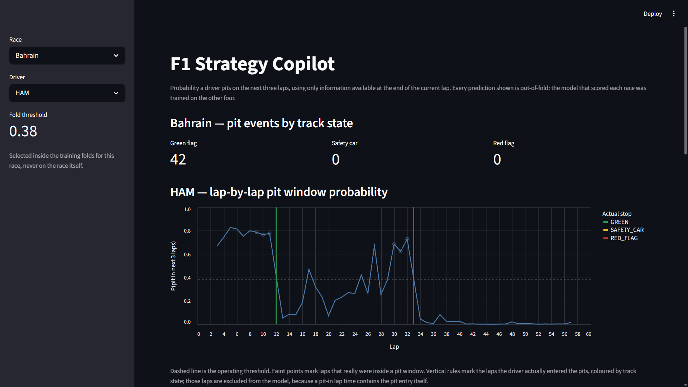
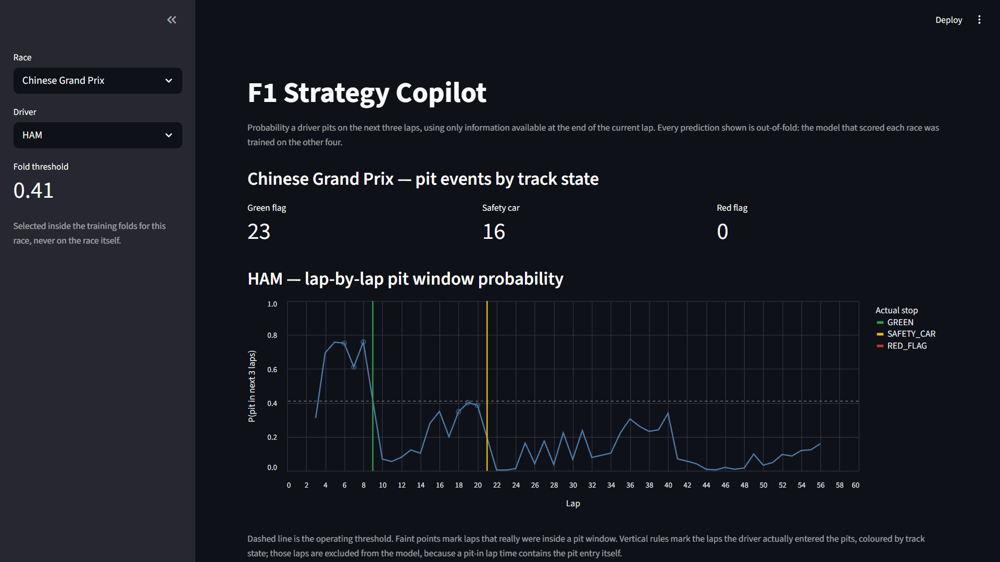
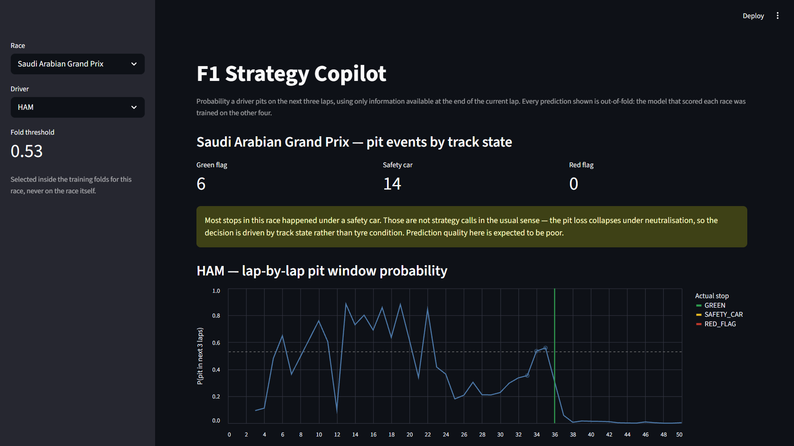

# F1 Strategy Copilot

Estimates the probability that a Formula 1 driver pits within the next three laps, using only information available at the end of the current lap.

This is a **behavioural prediction model**, not a strategy optimiser. It learns what teams historically do given a race state. It does not compute what they should do — that would need counterfactual race simulation, a tyre degradation model, pit-loss estimates and an explicit race-outcome objective. None of those are here.



Both of Hamilton's stops in Bahrain are anticipated: probability climbs past 0.8 in the laps before lap 12, drops to near zero once he is on fresh tyres, then rebuilds through the second stint before the lap-33 stop. The dashed line is the operating threshold for that fold.

---

## Results

Five 2024 races, leave-one-race-out cross-validation. Every number below comes from a model that never saw the race it scored.

| Held-out race | Laps | Positives | Threshold | Precision | Recall | F1 | PR-AUC |
|---|---|---|---|---|---|---|---|
| Bahrain | 1046 | 123 | 0.38 | 0.309 | 0.976 | 0.470 | 0.365 |
| Chinese GP | 928 | 117 | 0.41 | 0.396 | 0.487 | 0.437 | 0.427 |
| Australian GP | 921 | 107 | 0.49 | 0.324 | 0.626 | 0.427 | 0.365 |
| Japanese GP | 803 | 103 | 0.47 | 0.316 | 0.699 | 0.435 | 0.442 |
| Saudi Arabian GP | 815 | 57 | 0.53 | 0.088 | 0.298 | 0.136 | 0.088 |
| **Mean ± std** | | | | **0.287 ± 0.116** | **0.617 ± 0.252** | **0.381 ± 0.138** | **0.337 ± 0.144** |

Excluding Saudi Arabia, which contains almost no green-flag strategy content, the remaining four folds give **PR-AUC 0.400 ± 0.038**.

| | PR-AUC |
|---|---|
| Base rate (always predict no pit) | 0.112 |
| Tyre life > 80th percentile | 0.120 |
| **Random Forest, 7 features** | **0.337** |

Tyre age alone is worth almost nothing over the base rate. The model earns its complexity at roughly 3× lift on unseen circuits, but it is not a strong model.

**Mean accuracy is 0.778. Always predicting "no pit" scores 0.888.** The model is less accurate than the trivial baseline while being considerably more useful. Accuracy appears nowhere else in this document.

---

## Two corrections that cost most of the original performance

An earlier version reported 0.91 accuracy, 0.56 precision and 0.72 recall. Both numbers were inflated, for reasons that are independent of each other.

### The label included the current lap

The original target marked lap *t* positive if a pit occurred on laps *t*, *t+1* or *t+2*. Every pit-in lap was therefore a positive example of itself.

A pit-in lap carries the pit entry inside its own lap time. Measured against each driver's median lap in that race, across 172 in-laps:

| | Delta vs driver median |
|---|---|
| Median | +5.4s |
| 75th percentile | +15.7s |
| Max | +45.1s |
| Min | +0.4s |

`LapTimeSeconds` was in the feature set. **Of 541 original positives, 200 were pit-in laps** — roughly 35% of the positive class.

The corrected label covers *t+1* through *t+3*, and pit-in laps are dropped from the modelling set. Labels are computed on lap numbers rather than row offsets, because the raw pipeline drops rows for missing timing data and row *i+1* is not always lap *n+1*.

The +5.4s median is not separable on its own, so the lap-time delta is not the evidence. The evidence is downstream: precision falls from a reported 0.56 to a measured 0.287.

### The split was random across laps

Adjacent laps are near-duplicates. Lap 26 in test with laps 25 and 27 in training is not a held-out observation.

This version splits by race with `GroupKFold` on the event. The operating threshold is chosen inside each training fold via nested grouped CV, never on the held-out race. The previous fixed threshold of 0.60 had been selected by looking at test-set results.

---

## Absolute lap time encodes circuit identity

Not visible until you split by race.

| Race | Median lap | Min | Max |
|---|---|---|---|
| Australian GP | 82.7s | 79.8 | 128.5 |
| Saudi Arabian GP | 94.2s | 91.6 | 149.5 |
| Bahrain | 96.9s | 92.6 | 132.4 |
| Japanese GP | 97.5s | 93.7 | 149.0 |
| Chinese GP | 101.9s | 97.8 | 150.0 |

Australia's *median* lap is 15 seconds faster than China's *fastest* lap. The distributions do not overlap. Hold a circuit out and every lap-time split learned in training fires on the wrong side of it — the model was using lap time as a track ID.

The four absolute timing features (`LapTimeSeconds` and three sector times) were replaced with three circuit-invariant ones:

| Feature | Definition |
|---|---|
| `PaceVsRaceMedian` | lap time − median lap of that race |
| `PaceVsDriverBaseline` | lap time − that driver's median lap in that race |
| `PaceTrend3` | change in 3-lap rolling mean pace |

| | Absolute timing | Normalised pace |
|---|---|---|
| Precision | 0.219 ± 0.100 | 0.330 ± 0.121 |
| PR-AUC | 0.313 ± 0.145 | 0.324 ± 0.125 |
| Selected thresholds | 0.07 – 0.23 | 0.32 – 0.44 |

Ranking barely moved; the probability scale became comparable across circuits. With absolute timing the model flooded four of five races, flagging a window on roughly half of all laps. A separate run constraining precision to ≥ 0.40 found **no threshold could reach that floor on three of five folds**.

---

## Feature reduction

Permutation importance on held-out races, scored by average precision, 10 repeats per fold:

| Feature | AUS | BHR | CHN | JPN | SAU | Mean |
|---|---|---|---|---|---|---|
| `TyreLife` | 0.114 | 0.085 | 0.092 | 0.123 | −0.009 | **0.081** |
| `PaceVsDriverBaseline` | 0.111 | 0.064 | 0.126 | 0.097 | 0.004 | **0.080** |
| `LapNumber` | 0.108 | −0.005 | 0.097 | 0.060 | 0.023 | **0.057** |
| `PaceVsRaceMedian` | 0.026 | −0.005 | 0.105 | 0.062 | 0.017 | 0.041 |
| `Position` | 0.024 | 0.007 | 0.012 | 0.055 | 0.002 | 0.020 |
| `PaceTrend3` | 0.022 | −0.003 | −0.012 | 0.073 | −0.001 | 0.016 |
| `IsSafetyCar` | 0.000 | 0.000 | 0.001 | 0.000 | 0.001 | 0.000 |

An earlier eleven-feature version also carried `Stint`, `IsSoft`, `IsMedium` and `IsHard`. On the Bahrain fold those scored **−0.050, −0.036, 0.000 and −0.072** — permuting them *improved* held-out PR-AUC. They encode compound and stint patterns specific to a circuit's tyre allocation, which do not transfer. Dropping them raised PR-AUC from 0.324 to 0.337.

The trade-off is real and visible in the charts. Precision fell from 0.325 to 0.287 and selected thresholds rose to 0.34–0.53, so the model now clears its own decision line by a narrower margin. More non-window laps sit near the true positives. PR-AUC is the metric that survives a change of operating point, so seven features is the version kept, but the separation is thinner than the eleven-feature model's.

`IsSafetyCar` contributes nothing on any fold. It is a per-lap flag, and by the time a safety car is deployed the decision has effectively been made — the feature arrives too late. It is retained to document that.

### `PaceVsDriverBaseline` is not a degradation signal

Among flagged laps, true windows sit at a median **+0.78s** off the driver's baseline and false positives at **+0.61s**. The distributions barely differ at the centre. What the feature contributes is a *negative* signal: 14 flagged laps exceed +10s off baseline and **none** are real windows. A lap far off baseline means neutralisation, traffic or a mistake, not a strategic stop.

---

## Not every pit stop is a strategy decision

192 pit events across five races, classified by track state:

| Race | Green flag | Safety car | Red flag |
|---|---|---|---|
| Bahrain | 42 | 0 | 0 |
| Australian GP | 32 | 4 | 0 |
| Japanese GP | 31 | 6 | 18 |
| Chinese GP | 23 | 16 | 0 |
| Saudi Arabian GP | **6** | 14 | 0 |

Red-flag stops (the Japan lap-1 restart) are excluded — they are not decisions. Safety-car stops are kept but tagged, because they are a different decision: under neutralisation the pit loss collapses, so the call is driven by track state rather than tyre condition.

Safety-car events are identified by FastF1 track status combined with a same-lap clustering rule: six or more stops on one lap in a twenty-car field is a neutralisation, not twenty independent calls. Six is a stated assumption, not a tuned parameter.



China shows the difference in a single chart. Hamilton's lap-9 stop is a green-flag call and the model peaks near 0.75 going into it. His lap-21 stop is under the safety car and the model sits near 0.10 — nothing in the race state up to lap 20 pointed at it, because the trigger was the neutralisation itself.

That gap is consistent across the set: **recall 0.674 ± 0.209 on green-flag stops, 0.520 ± 0.390 on safety-car stops.**



**Saudi Arabia is the extreme case and explains the worst fold.** Its PR-AUC of 0.088 sits at its own base rate of 0.070, because 14 of its 20 pit events happened on a single lap under the safety car. Six green-flag strategy calls remain across 815 laps. The model is not failing there; there is very little strategic content to predict. The dashboard raises this warning by itself whenever safety-car stops outnumber green-flag ones.

---

## Reproducing this on other races and drivers

Everything below runs from the committed dataset except step 1, which needs network access to FastF1.

### Change which races are in the dataset

`src/data_pipeline.py`, near the top:

```python
RACES = [
    (2024, "Bahrain", "R"),
    (2024, "Saudi Arabian Grand Prix", "R"),
    (2024, "Australian Grand Prix", "R"),
    (2024, "Japanese Grand Prix", "R"),
    (2024, "Chinese Grand Prix", "R"),
]
```

Each tuple is `(season, event, session)`. FastF1 fuzzy-matches the event string, so `"Bahrain"` and `"Bahrain Grand Prix"` both resolve — that is why the list above is inconsistently named. Use `fastf1.get_event_schedule(2024)` to see valid names for a season.

```bash
python src/data_pipeline.py
```

This overwrites `data/race_data.csv`. It downloads each race in turn and caches to `~/.fastf1`, so a second run is fast. Expect FastF1 warnings about incomplete data on some sessions; they do not stop dataset generation.

**Minimum three races.** The outer `GroupKFold` uses one fold per event, and the inner threshold-selection CV needs at least two training events to work with.

### Change the prediction horizon

`src/dataset.py`, `build_modelling_set(window=3)`. A window of 5 gives a longer, easier horizon and a higher positive rate; a window of 1 asks whether the driver pits on the very next lap and will be much harder. The label is computed on lap numbers, so gaps in the data do not shift it.

### Change the features

`src/model.py`, the `FEATURES` list. Anything you add must exist as a column after `prepare()` runs, and `prepare()` drops rows with nulls in any listed feature — so a feature with many nulls silently shrinks the dataset. Check the per-race row counts printed by `model.py` after any change.

### Re-run the evaluation

```bash
python src/model.py
```

Prints the per-race table, the mean ± std block and the baselines, then writes `data/oof_predictions.csv` for the dashboard. Runtime is a few minutes: five outer folds, each fitting four inner forests for threshold selection plus one final model.

### Look at any driver in any race

```bash
python -m streamlit run app/streamlit_app.py
```

Race and driver are selectable in the sidebar. Every probability shown is out-of-fold — the model that scored each race was trained on the other four, so nothing in the app is an in-sample prediction. The app reports its own false-positive rate per driver rather than hiding it, marks actual pit laps as excluded from the model, and warns when a race's stops are mostly safety-car responses.

`data/oof_predictions.csv` is committed so the app runs immediately after cloning. It goes stale if you change the model without re-running it.

### Things that will bite you

**Wet races break the compound encoding.** `IsSoft`/`IsMedium`/`IsHard` map INTERMEDIATE and WET to `0,0,0`, indistinguishable from missing. Those features are not in the current model, but if you reinstate them, add `IsIntermediate` and `IsWet` first.

**`PaceTrend3` discards the first two laps of every driver's race.** For drivers who retire early this can remove them from the evaluation entirely. Verstappen has one scored lap in Australia 2024 for exactly this reason.

**The safety-car clustering rule assumes a roughly twenty-car field.** `NEUTRALISATION_CLUSTER = 6` in `dataset.py`. Change it if you use a different series or a heavily attrited race.

**Adding seasons works without code changes.** `Season` is already part of the grouping keys in `dataset.py`, so per-driver labels never leak across seasons. Note that 2026 is a regulations reset — different power units, aero and tyre construction — so mixing it with earlier seasons trains one model on two different strategy regimes. It is more useful as a held-out test of regime shift than as training data.

---

## An anomaly I cannot explain

Bahrain is the only race in the set with zero neutralisations: 42 green-flag stops, no safety car, no red flag. It should be the cleanest strategy race available. Yet it is the one fold where `LapNumber`, `PaceVsRaceMedian` and `PaceTrend3` all score at or below zero on permutation importance, while the other three healthy folds are strongly positive on all three.

I do not have an explanation. It is round 1 of the season, so early-season strategy differing systematically from later races is one possibility, but five races is far too few to test that.

---

## Limitations

- **Five races is not enough.** Five folds cannot separate a real improvement from fold noise, and most of the ±0.144 PR-AUC spread is one structurally unusual race.
- **Green-flag-only evaluation is not possible at this sample size.** Isolating it would leave Saudi Arabia with 18 positive rows.
- **Probabilities are not calibrated.** A predicted 0.5 does not mean half such laps see a pit. Calibration is the obvious next step and has not been done.
- **No race context features.** Gap to cars ahead and behind, competitor tyre age, undercut threat and pit-loss estimates are all absent, and all matter more to a real strategy call than anything currently in the model.
- **The safety-car clustering rule is unvalidated** against official FIA race control messages. It agrees with the known neutralisations in these five races and has not been tested further.
- **Only one model family was tried.** No logistic regression, no gradient boosting, no hyperparameter search beyond the values recorded in `RF_PARAMS`.
- **No unit tests.** The label horizon and the cross-race grouping are the two places a silent regression would do most damage and both are currently unguarded.

---

## Layout

```
src/data_pipeline.py   FastF1 acquisition and raw feature extraction
src/dataset.py         Label definition, pit-context classification, row filtering
src/model.py           Race-level cross-validation, evaluation, out-of-fold dump
app/streamlit_app.py   Dashboard over out-of-fold predictions
data/race_data.csv     Committed — model.py runs without a FastF1 download
data/oof_predictions.csv
```

`dataset.py` is deliberately separate from `data_pipeline.py`. Label and filtering changes iterate against the committed CSV in seconds instead of re-downloading five races.

## Install and run

```bash
pip install -r requirements.txt
python src/model.py
python -m streamlit run app/streamlit_app.py
```

Python 3.12. Dependency versions in `requirements.txt` are pinned to what was actually tested — pandas 3.x changes `groupby().apply()` behaviour that `dataset.py` relies on.

Stack: FastF1, pandas, scikit-learn, Streamlit, Altair.

---

## Disclaimer

Independent, unofficial educational project, not affiliated with Formula 1, the FIA, or any Formula 1 team. Timing data accessed via [FastF1](https://github.com/theOehrly/Fast-F1). Formula 1 and related marks are trademarks of their respective owners. Review applicable data-source terms before redistributing underlying timing data.